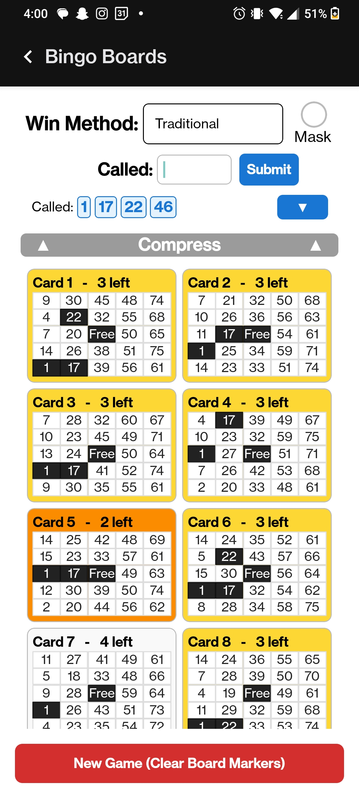
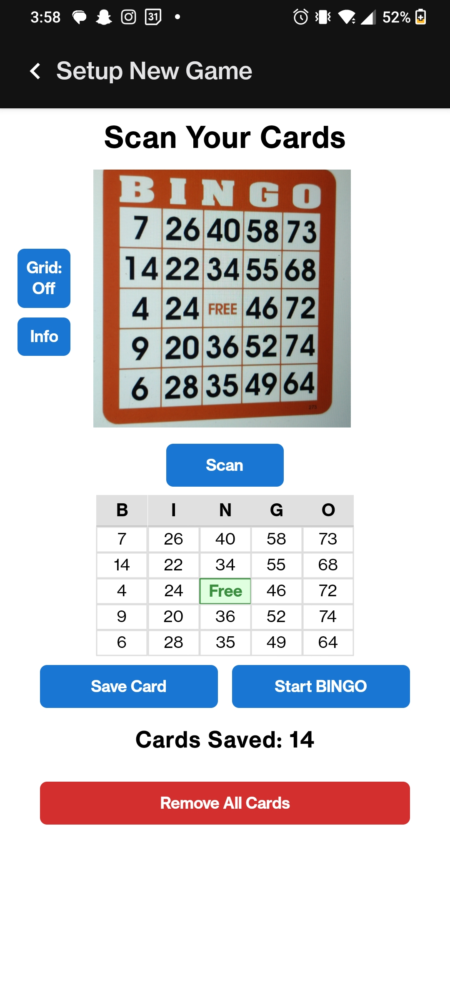
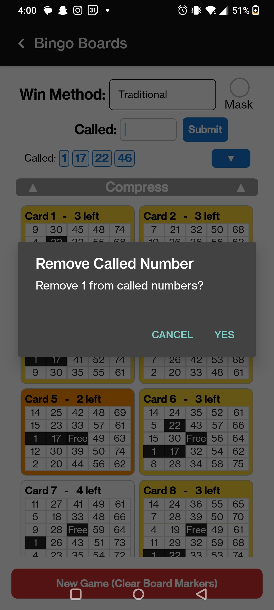
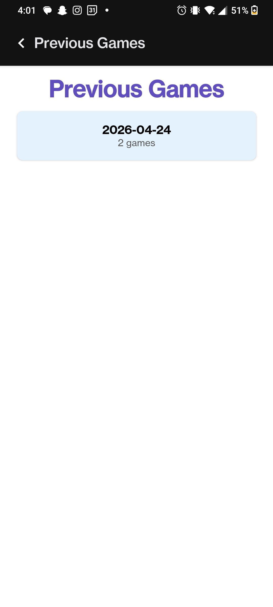

# 
# Bingo Tracker

- A lightweight React Native app (Expo + TypeScript) for creating and playing multiple Bingo boards, scanning full cards, and managing previous game boards.

- Track and play all your Bingo boards at the same time without ever marking them! You can even play the same boards between different rounds! 

- This app is for all people interested in Bingo! Try it for fun or to play competitively!

**Features**
- Create and manage multiple bingo boards
# 
- Full-card OCR scanning
# 
- Mark/unmark numbers interactively as they are called
# 
- Save and view previous boards and games played
# 

**Tech stack**
- **React Native** (**TypeScript**)
- **Expo tooling** (app.json, expo-env.d.ts)
- **Android native build files** present (`android/` with Gradle)
- **MLKit** for scanning Bingo Boards

## Prerequisites
- Node.js - [Download and install here](https://nodejs.org/en/download)
- Yarn or npm
- For Android builds: Android SDK (minimum Android SDK Platform 35) - follow directions [here](https://reactnative.dev/docs/set-up-your-environment) to set up the SDK with Android Studio

## Quick Setup 
1. Clone the repo and open it:

   ```bash
   git clone https://github.com/ajfrist/BingoTracker
   cd BingoTracker
   ```

2. Install JS dependencies (choose one):

   ```bash
   npm install
   # or
   yarn install
   ```

3. Start the Metro/Expo dev server:

   ```bash
   npx expo start
   ```


## Installation on Android Device with React Native

Run the application natively on an Android device or emulator. 

1. Download and configure PATH to the Android SDK

   - Ensure `platform-tools` folder is added to the system PATH, and that the `ANDROID_HOME` variable points to the `Android/Sdk` folder. 
   - Detailed instructions and help can be found on the [React Native docs](https://reactnative.dev/docs/set-up-your-environment?platform=android). 

2. Install dependencies

   ```bash
   npm install
   ```

3. Connect your android device via USB cable to your computer, or boot up an Android virtual device. 

   - Physical devices connected should have *USB Debugging* option enabled in **Developer Settings**. 

   - Verify your device is actively connected and recognized by running: 
   
   ```bash
   adb devices
   ```

4. Build and Run the application

   Run the following command to boot the application on the device and configure the `android` build folder:

   ```bash
   npx expo run:android
   ```

5. Build a release APK file to install onto your device 

   ```bash
   cd android
   ./gradlew assembleRelease
   ```

   - This generates an APK file at `android/app/build/outputs/apk/release/app-release.apk` that can be installed on your physical device. 
   - This application functions like any other, meaning you do not need to be plugged into your computer to run the app. 
